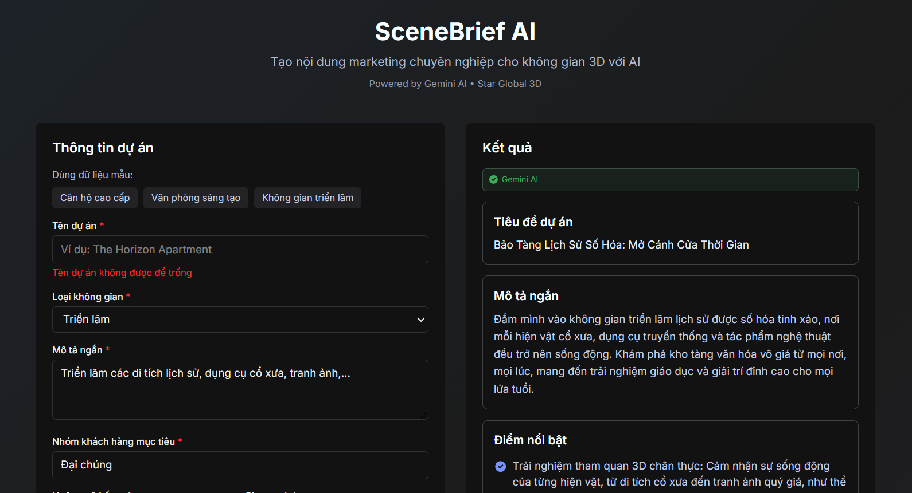
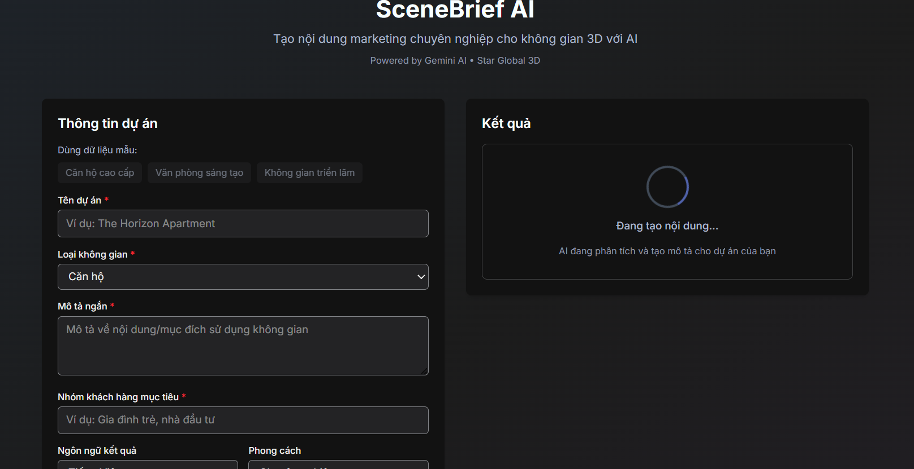
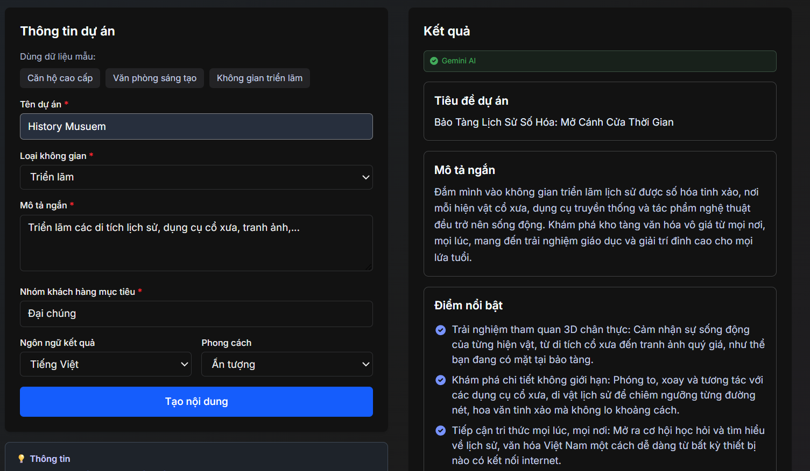
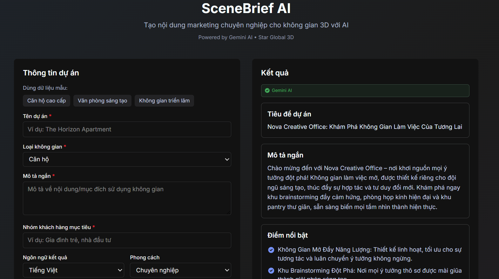
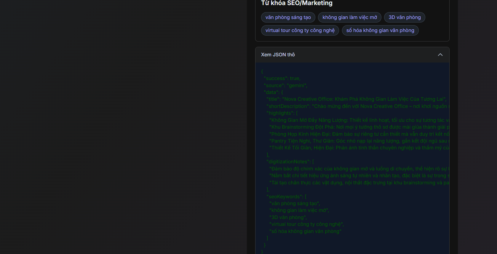

# SceneBrief AI - Star Global 3D Internship Test

> **AI-powered marketing content generator cho không gian 3D số hóa**  
> Tạo tiêu đề, mô tả, highlight và SEO keywords chuyên nghiệp cho virtual tours

---

## 📋 Thông tin dự án

- **Ứng viên**: [Tên của bạn]
- **Vị trí**: Thực tập sinh Công nghệ - Star Global 3D
- **Lựa chọn**: Option A - AI 3D Scene Describer
- **Tech Stack**: Next.js 15, TypeScript, Tailwind CSS, LiteLLM Proxy
- **Thời gian hoàn thành**: 2 ngày

---

## 🚀 Cài đặt nhanh (Quick Start)

### Bước 1: Clone & Install

```bash
# Di chuyển vào thư mục project
cd scene-brief-ai

# Cài đặt dependencies
npm install
```

### Bước 2: Cấu hình API Key (Tùy chọn)

Tạo file `.env.local`:

```env
GEMINI_API_KEY=your_litellm_api_key_here
LITELLM_BASE_URL=https://litellm.vault.io.vn
```

> ⚠️ **Lưu ý**: App hoạt động KHÔNG CẦN API key (sử dụng Mock AI fallback)

### Bước 3: Chạy Development Server

```bash
npm run dev
```

Mở trình duyệt tại: **http://localhost:3000**

---


## ✨ Demo nhanh

1. Click nút **"Căn hộ cao cấp"** để auto-fill form
2. Click **"Tạo nội dung"**
3. Xem kết quả AI generate với:
   - Tiêu đề dự án
   - Mô tả marketing
   - Điểm nổi bật (highlights)
   - Lưu ý số hóa 3D
   - Từ khóa SEO

---

## 📸 Manual Testing Screenshots

### 1. Form Validation - Empty Fields

*Kiểm tra validation khi submit form trống - Error messages hiển thị đầy đủ*

### 2. Loading State

*Loading spinner hiển thị khi đang generate content với AI*

### 3. AI Generated Content

*Kết quả generate từ Gemini AI với badge xanh - Hiển thị title, description, highlights, digitization notes, và SEO keywords*

### 4. Mock AI Fallback

*Mock AI fallback tự động kích hoạt khi Gemini API không khả dụng - Notice màu vàng hiển thị*

### 5. JSON Viewer

*Raw JSON response viewer - Collapsible section để xem chi tiết API response*

---

## 🎯 Tính năng chính

### ✅ Đã hoàn thành
- **Vietnamese UI** với output song ngữ (Tiếng Việt/English)
- **LiteLLM Proxy Integration** thay vì Google SDK trực tiếp
- **Hybrid AI Strategy**: Gemini AI + Mock AI Fallback
- **Prompt Engineering** với tone control (professional/dynamic/impressive)
- **3 Sample Scenarios** cho demo nhanh
- **Input Validation** (frontend + backend với Zod)
- **localStorage** cho lịch sử kết quả
- **Responsive Design** (desktop + mobile)
- **JSON Viewer** để xem raw response
- **Error Handling** với automatic fallback

### 🎨 UI/UX
- Two-column layout (form bên trái, kết quả bên phải)
- Loading states với spinner
- Error messages rõ ràng
- Source badge (Gemini AI / Mock AI)
- Collapsible JSON viewer

---

## 📁 Cấu trúc project

```
StarGlobal3d/
├── scene-brief-ai/              # Next.js application
│   ├── app/
│   │   ├── api/
│   │   │   └── describe-scene/
│   │   │       └── route.ts     # ⭐ Backend API endpoint
│   │   ├── page.tsx             # ⭐ Main application
│   │   ├── layout.tsx
│   │   └── globals.css
│   ├── components/              # ⭐ React components
│   │   ├── SceneForm.tsx
│   │   ├── ResultCards.tsx
│   │   ├── JsonViewer.tsx
│   │   ├── SampleScenarioButtons.tsx
│   │   ├── LoadingState.tsx
│   │   └── ErrorMessage.tsx
│   ├── lib/
│   │   ├── ai/                  # ⭐ AI Layer
│   │   │   ├── gemini.ts        # LiteLLM proxy integration
│   │   │   ├── mockSceneAI.ts   # Template-based fallback
│   │   │   └── scenePrompt.ts   # Prompt builder
│   │   ├── validation/
│   │   │   └── sceneSchema.ts   # Zod validation
│   │   ├── storage/
│   │   │   └── recentResults.ts # localStorage utils
│   │   └── data/
│   │       └── sampleScenarios.ts
│   ├── types/
│   │   └── scene.ts             # TypeScript types
│   ├── .env.local               # ⚠️ KHÔNG commit (gitignored)
│   ├── .env.example             # Template cho .env.local
│   ├── package.json
│   ├── README.md                # Technical README
│   └── REPORT.md                # ⭐ Báo cáo chi tiết
├── doc/                         # 📚 Documentation
│   ├── Architecture.md          # Thiết kế kiến trúc
│   ├── API_Key.md              # Hướng dẫn setup API
│   ├── LiteLLM_Setup.md        # Hướng dẫn LiteLLM proxy
│   └── ScriptSummary.md        # ⭐ Breakdown code (cho phỏng vấn)
├── .gitignore
└── README.md                    # ⭐ File này (README chính)
```

---

## 🔧 Tech Stack chi tiết

### Frontend
- **Next.js 15** (App Router) - Full-stack framework
- **React 19** - UI library
- **TypeScript** - Type safety
- **Tailwind CSS** - Styling
- **Zod** - Runtime validation

### Backend
- **Next.js API Routes** - Backend endpoints
- **LiteLLM Proxy** - Unified LLM gateway
- **Gemini AI** (`gemini-free` model via LiteLLM)

### Storage
- **localStorage** - Client-side history (no database needed)

---

## 💡 Kiến trúc & Design Decisions

### 1. Tại sao chọn Option A (AI 3D Scene Describer)?
✅ **Phù hợp với business của Star Global 3D**
- Công ty chuyên tạo virtual tours cho địa điểm du lịch, di sản
- Cần marketing content cho từng tour
- Tool này giúp sales/marketing team tạo content nhanh

✅ **Clear scope** - Dễ demo trong 2 ngày

### 2. Tại sao dùng LiteLLM Proxy thay vì Google SDK?
✅ **OpenAI-compatible format** - Dễ đổi provider (Gemini → GPT-4 → Claude)  
✅ **Không cần Google SDK** - Giảm bundle size  
✅ **Dùng native fetch** - No additional dependencies  
✅ **Company control** - Proxy quản lý rate limiting, monitoring, cost  

### 3. Hybrid AI Strategy
```
User Request
    ↓
Try Gemini AI (via LiteLLM)
    ↓
Success? → Return Gemini result
    ↓
Fail? → Automatic Mock AI Fallback
    ↓
Always works!
```

**Lợi ích**:
- ✅ App luôn hoạt động (demo không bị block)
- ✅ User không thấy error (graceful degradation)
- ✅ Mock AI templates chất lượng cao

---

## 📊 API Documentation

### POST `/api/describe-scene`

**Request:**
```json
{
  "projectName": "The Horizon Apartment",
  "spaceType": "apartment",
  "description": "Căn hộ cao cấp 2 phòng ngủ",
  "targetCustomers": "Gia đình trẻ, nhà đầu tư",
  "outputLanguage": "vi",
  "tone": "professional"
}
```

**Response (Success):**
```json
{
  "success": true,
  "source": "gemini",
  "data": {
    "title": "The Horizon Apartment - Căn Hộ Cao Cấp...",
    "shortDescription": "Khám phá không gian sống...",
    "highlights": ["Thiết kế hiện đại", "View đẹp", ...],
    "digitizationNotes": ["Chụp vào buổi sáng", ...],
    "seoKeywords": ["căn hộ cao cấp", "virtual tour", ...]
  }
}
```

**Response (Fallback):**
```json
{
  "success": true,
  "source": "mock",
  "notice": "Gemini API không khả dụng, đã sử dụng mock AI fallback.",
  "data": { ... }
}
```

---

## 🧪 Testing

### Manual Testing Checklist

```bash
# Test 1: Validation
[ ] Submit empty form → Hiển thị error messages

# Test 2: Sample Scenarios
[ ] Click "Căn hộ cao cấp" → Auto-fill + generate
[ ] Click "Văn phòng sáng tạo" → Auto-fill + generate
[ ] Click "Không gian triển lãm" → Auto-fill + generate

# Test 3: AI Integration
[ ] Có API key → Badge xanh "✓ Gemini AI"
[ ] Không có API key → Thông báo vàng "Mock AI Fallback"

# Test 4: Output Languages
[ ] Generate tiếng Việt → Content correct
[ ] Generate English → Content correct

# Test 5: UI/UX
[ ] Loading spinner hiện khi generate
[ ] JSON viewer expand/collapse hoạt động
[ ] Responsive layout (resize browser)

# Test 6: Error Handling
[ ] Network error → Fallback to mock AI
[ ] Invalid API key → Fallback to mock AI
```

### Debug Logs

Khi có lỗi, check terminal logs:
```bash
[LiteLLM Debug] API Key: sk-Czgyjr8...
[LiteLLM Debug] Base URL: https://litellm.vault.io.vn
[LiteLLM Debug] Response status: 200
```

---

## 📚 Documentation

Xem thêm trong folder `doc/`:

- **`Architecture.md`** - Chi tiết kiến trúc và design decisions
- **`API_Key.md`** - Hướng dẫn setup Gemini API key
- **`LiteLLM_Setup.md`** - Hướng dẫn configure LiteLLM proxy
- **`ScriptSummary.md`** - ⭐ Breakdown toàn bộ code (cho phỏng vấn)
- **`REPORT.md`** (trong scene-brief-ai/) - Báo cáo chi tiết về AI usage

---

## 🎓 Highlights cho nhà tuyển dụng

### Code Quality
✅ **Type-safe** với TypeScript + Zod schemas  
✅ **Modular architecture** - Components, lib, types tách riêng  
✅ **Error handling** - Try-catch + fallback mechanism  
✅ **Clean code** - Small functions, clear naming, comments  

### Best Practices
✅ **Validation 2 lớp** - Frontend (UX) + Backend (security)  
✅ **Environment variables** - API keys không hardcode  
✅ **Responsive design** - Mobile-friendly  
✅ **User feedback** - Loading states, error messages, success indicators  

### Production Ready Features
✅ **Automatic fallback** - App luôn hoạt động  
✅ **Debug logging** - Dễ troubleshoot  
✅ **Sample data** - Demo-ready  
✅ **Documentation** - Comprehensive guides  

### Technical Skills Demonstrated
- ✅ Full-stack development (Next.js)
- ✅ AI/LLM integration (Gemini via LiteLLM)
- ✅ Prompt engineering
- ✅ API design
- ✅ State management (React hooks)
- ✅ TypeScript
- ✅ Tailwind CSS
- ✅ Git (proper gitignore, no secrets)

---

## 🚢 Production Deployment

### Build & Deploy

```bash
# Build for production
npm run build

# Test production build locally
npm start
```

### Deploy to Vercel

1. Push code lên GitHub
2. Import vào [vercel.com](https://vercel.com)
3. Add environment variables:
   - `GEMINI_API_KEY` = your key
   - `LITELLM_BASE_URL` = https://litellm.vault.io.vn
4. Click Deploy

---

## 📝 Notes cho nhà tuyển dụng

### Điểm mạnh của solution này:

1. **Business alignment** - Giải quyết đúng pain point của Star Global 3D (tạo marketing content cho virtual tours)

2. **Reliability** - Hybrid AI strategy đảm bảo app luôn hoạt động, demo không bị gián đoạn

3. **Scalability** - Modular architecture dễ extend:
   - Thêm providers khác (GPT-4, Claude)
   - Thêm output formats (PDF, Word)
   - Thêm languages (English, Chinese)

4. **Production-ready** - Có đầy đủ:
   - Error handling
   - Validation
   - Environment config
   - Documentation
   - Testing checklist

### Potential improvements (nếu có thêm thời gian):

- [ ] Database thay localStorage
- [ ] User authentication
- [ ] History panel UI
- [ ] Copy-to-clipboard buttons
- [ ] Export to PDF/Word
- [ ] Batch processing (upload CSV)
- [ ] Advanced prompt customization
- [ ] A/B testing different prompts

---

## 📞 Contact

Nếu có thắc mắc về technical implementation, xem:
- **`scene-brief-ai/REPORT.md`** - AI usage report

---

## 🙏 Cảm ơn

Cảm ơn Star Global 3D đã cho cơ hội thực hiện bài test này!

Project này thể hiện khả năng:
- Full-stack development
- AI/LLM integration
- Product thinking
- Technical documentation
- Clean code practices

Mong được thảo luận thêm trong buổi phỏng vấn! 🚀
